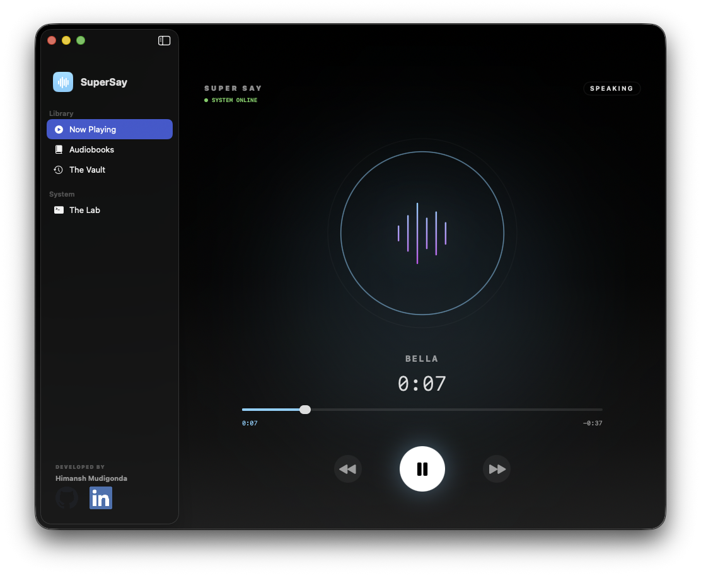

# 🎙️ SuperSay

**The Ultimate AI Voice Utility for macOS.**

SuperSay is a professional, set-and-forget utility that transforms any text on your screen into ultra-realistic AI speech. Built with a focus on cinematic audio quality, smooth system integration, and high-performance parallel processing.




---

## ✨ Key Features

### 🎬 Cinematic Audio Environment

*   **Smart Music Ducking**: Automatically fades your Music or Spotify volume down to 10% when speaking and glides it back up with a 1-second "cinematic buffer."
*   **Zero-Overlap Logic**: Ensures the AI never battles your music. It waits for the fade-down to complete before the first word is spoken.
*   **Digital Boost**: Includes a digital gain stage allowing for up to **150% volume amplification** without distortion.

### 🧠 High-Performance Extraction

*   **Parallel Generation Pipeline**: Splits long articles into sentences and generates audio in parallel via a Python backend.
*   **Binary Header Patching**: Manually reconstructs WAV headers to merge parallel chunks into a single, seamless track—perfect for long-form reading.
*   **Intelligent Text Purification**: Strips bullet points, URLs, and non-text artifacts to prevent TTS engine crashes.

### 🌎 Global Intelligence

*   **Auto-Language Detection**: Uses Apple's `NaturalLanguage` framework to instantly detect and switch between English, French, Japanese, and Chinese.
*   **The Vault**: A searchable, starred history of everything you've ever "SuperSaid." Never lose a great snippet again.
*   **Native Integration**: Secure modern "Launch at Login" support and centralized system environment controls.

---

## 🛠️ Tech Stack

### Frontend (macOS)

*   **SwiftUI**: For a modern, glassmorphic dashboard.
*   **AVFoundation**: High-fidelity audio playback and session management.
*   **ServiceManagement**: For secure, modern "Launch at Login" items.
*   **KeyboardShortcuts**: Native global hotkey registration.

### Backend (Python/TTS)

*   **FastAPI**: Ultra-fast asynchronous REST API.
*   **Kokoro v1.0**: The state-of-the-art ONNX-based TTS model.
*   **SoundFile & NumPy**: High-performance audio signal processing.
*   **uv**: Blazing fast Python package management.

---

## 🚀 Getting Started

### Option 1: Download (Recommended for Users)

1. Go to [**Releases**](https://github.com/himudigonda/SuperSay/releases)
2. Download the latest `SuperSay-x.x.x.dmg`
3. Open the DMG and drag **SuperSay** to your Applications folder
4. Launch SuperSay from Applications
5. **First Run:** macOS will ask for Accessibility permissions (System Preferences → Privacy & Security → Accessibility)

> **Note:** If macOS blocks the app, right-click and select "Open" to bypass Gatekeeper.

---

### Option 2: Build from Source (For Developers)

#### Prerequisites
- macOS 14.0+ (Sonoma or later)
- Xcode 15+
- Python 3.11+ with [uv](https://github.com/astral-sh/uv) package manager

#### 1. Clone the Repository

```bash
git clone https://github.com/himudigonda/SuperSay.git
cd SuperSay
```

#### 2. Download AI Models

Download these files and place them in the `backend/` folder:
- [`kokoro-v1.0.onnx`](https://huggingface.co/hexgrad/Kokoro-82M-v1.0-ONNX/resolve/main/kokoro-v1.0.onnx) (~325MB)
- [`voices-v1.0.bin`](https://huggingface.co/hexgrad/Kokoro-82M-v1.0-ONNX/resolve/main/voices-v1.0.bin) (~28MB)

#### 3. Compile the Backend

```bash
chmod +x scripts/compile_backend.sh
./scripts/compile_backend.sh
```

This creates a standalone `SuperSayServer` binary that gets bundled into the app.

#### 4. Build in Xcode

1. Open `SuperSay/SuperSay.xcodeproj`
2. Select your signing team (or use "Sign to Run Locally")
3. Build and Run (**⌘R**)

#### 5. Create a DMG for Distribution

```bash
./scripts/create_dmg.sh 1.0.0
```

The DMG will be created in the `build/` folder.

---

## ⌨️ Shortcuts

### 🎧 Playback Controls

| Action | Shortcut | Description |
| :--- | :--- | :--- |
| **Speak Selection** | `⌘` `⇧` `.` | Reads the currently selected text. |
| **Pause / Resume** | `⌘` `⇧` `/` | Pauses the AI mid-sentence or resumes playback. |
| **Stop** | `⌘` `⇧` `,` | Instantly stops playback and resets the progress. |

### 💾 Exporting

| Action | Shortcut | Description |
| :--- | :--- | :--- |
| **Export to Desktop** | `⌃` `⌘` `⇧` `/` | Generates audio and saves it as a `.wav` file to your Desktop. |

---

## 🏗️ Architecture

SuperSay uses a **Producer-Consumer** model for audio:

1. **Swift** captures selection -> **Python** receives text.
2. **FastAPI** splits text into chunks and runs parallel inference.
3. **Swift** receives chunks, strips headers, and performs **Binary Patching** to create a master WAV.
4. **AudioEngine** manages the hardware layer and system volume ducking.

---

## 📜 License & Contribution

This project is licensed under the **MIT License**. We welcome contributions focused on new voice models and browser-specific integration.

---

**Developed by Himansh Mudigonda**

[GitHub](https://github.com/himudigonda) | [LinkedIn](https://www.linkedin.com/in/himudigonda)

**Made by Professionals, for Professionals.**
