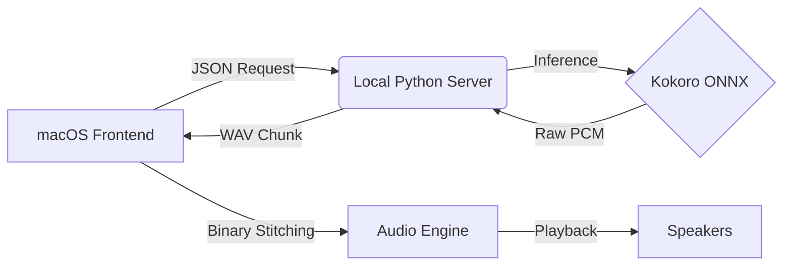

# 🎙️ SuperSay

> **Turn any text on your Mac into cinematic, ultra-realistic AI speech.**


**SuperSay** is a professional-grade text-to-speech utility for macOS. Unlike standard accessibility tools, SuperSay focuses on **audio fidelity** and **system integration**. It uses the state-of-the-art [Kokoro](https://huggingface.co/hexgrad/Kokoro-82M) model running locally to generate human-like speech while intelligently managing your system's audio environment (ducking music, pausing for phone calls).

---

## ✨ Why SuperSay?

* **🔒 Local & Private**: 100% offline inference. No data is ever sent to the cloud.
* **🎬 Cinematic Audio Engine**: Automatically "ducks" (lowers) Spotify or Apple Music volume smoothly while speaking, then fades it back in.
* **🧠 Parallel Processing**: Splits long articles into chunks and generates audio in parallel for instant playback.
* **🔌 Binary Patching**: Manually reconstructs WAV headers to stitch audio chunks into a single seamless track.
* **📦 The Vault**: A searchable history of everything you've listened to.

## 🏗️ Architecture

SuperSay operates on a **Producer-Consumer** model using Inter-Process Communication (IPC).



*   **Frontend**: Native SwiftUI app handling system events, global hotkeys, and audio session management.
*   **Backend**: A lightweight FastAPI server wrapping the ONNX runtime for high-performance inference.

## 🚀 Quick Start

### Prerequisites

* macOS 14.0 (Sonoma) or later
* Xcode 15+
* Python 3.11+ (We recommend [uv](https://github.com/astral-sh/uv))

### Installation

1. **Clone the Repo**

```bash
git clone https://github.com/yourusername/SuperSay.git
cd SuperSay
```

2. **Setup the Backend**

```bash
cd backend
uv sync
# Download models (See backend/README.md)
```

3. **Run the App**

* Open `frontend/SuperSay/SuperSay.xcodeproj` in Xcode.
* Build & Run (Cmd+R).

## 📚 Documentation

*   [**Architecture Deep Dive**](docs/ARCHITECTURE.md): How the Swift-Python bridge works.
*   [**Feature Roadmap**](docs/ROADMAP.md): What's coming next.
*   [**User Guide**](docs/USER_GUIDE.md): Keyboard shortcuts and best practices.
*   [**Backend Details**](backend/README.md): API and Model technicals.
*   [**Frontend Details**](frontend/README.md): SwiftUI architecture.
*   [**Contributing**](docs/CONTRIBUTING.md): How to build and submit PRs.

## 👩💻 For Developers

SuperSay includes a robust automation pipeline for code quality and building.

### 🛠️ The One-Click Workflow

We use a **Makefile** to automate the entire lifecycle.

| Command | Action |
| :--- | :--- |
| `make setup` | Installs Python dependencies (uv) and checks Xcode. |
| `make lint` | Runs **Ruff** (Python) and **SwiftLint** to enforce style. |
| `make test` | Runs **Pytest** suites on the inference engine. |
| `make build-backend` | Compiles the Python AI engine into a standalone binary. |
| `make dmg` | Builds the full macOS app and wraps it in a `.dmg` installer. |

### 📊 Telemetry & Analytics

SuperSay includes a privacy-focused telemetry module (`TelemetryService.swift`).
* **Collected Data:** App Launches, Character Counts, Export Counts.
* **Privacy:** No text content is ever logged or transmitted.
* **Configuration:** Users can opt-out via the "The Lab" settings panel.

## 🤝 Contributing

We welcome contributions! Please see [CONTRIBUTING.md](docs/CONTRIBUTING.md) for details on how to set up your development environment and submit Pull Requests.

## 📄 License

This project is licensed under the MIT License - see the [LICENSE](LICENSE) file for details.
