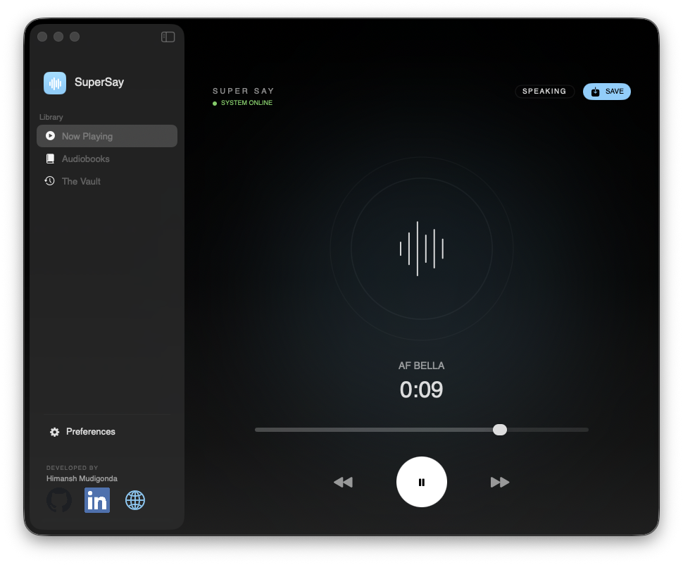
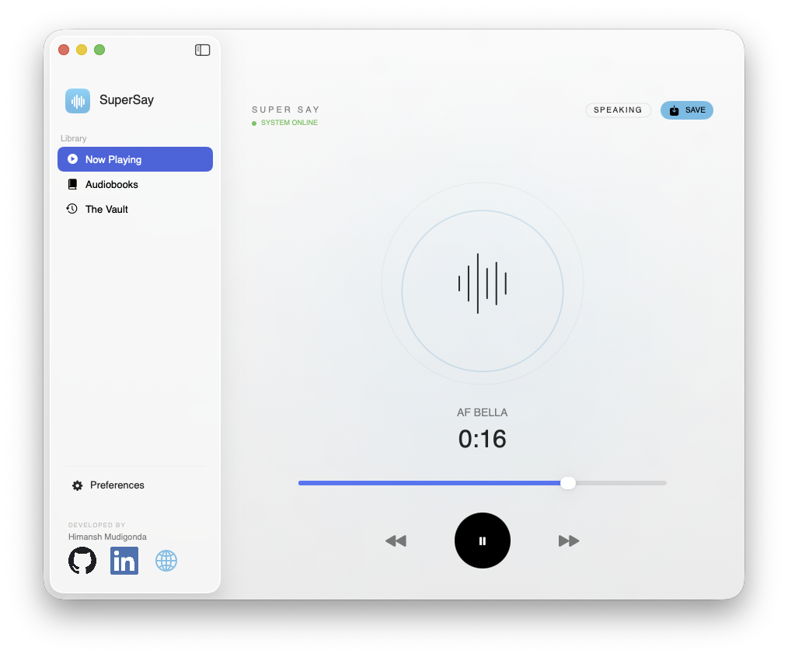
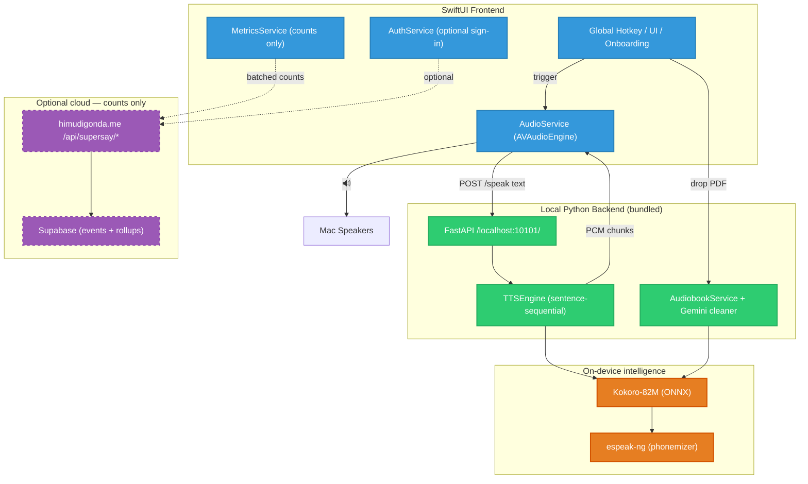

# 🎙️ SuperSay

> **Turn any text — or any PDF — on your Mac into cinematic, ultra-realistic AI speech. Fully on-device.**

<p align="center">
  
  
  
  
  
  
  
  
</p>

<p align="center">
  <b>Fast. Private. Local. Cinematic.</b><br>
  <i>TTS + audiobook generation that never sends your text to a server.</i>
</p>

<p align="center">
  
  
</p>

---

## 🚀 Quick Start — Run This First

> **Before anything else**, run this one command in Terminal after moving SuperSay to `/Applications`. Without it, macOS will refuse to open the app.

```bash
xattr -cr /Applications/SuperSay.app
```

**Why is this safe?**
macOS Gatekeeper blocks apps that aren't signed with a paid Apple Developer certificate ($99/year). SuperSay is open-source and unsigned — not because it's unsafe, but because it's not distributed through the App Store. This command strips the "quarantine" flag macOS sets on downloaded files. It does not disable Gatekeeper system-wide, bypass any security policy, or grant the app any extra permissions. You can verify the app's full source code in this repository.

After running it, double-click the app normally. macOS will open it without complaint.

---

## 📖 Table of Contents

- [🎙️ SuperSay](#️-supersay)
  - [🚀 Quick Start — Run This First](#-quick-start--run-this-first)
  - [📖 Table of Contents](#-table-of-contents)
  - [✨ Key Features](#-key-features)
  - [🔒 Privacy in one sentence](#-privacy-in-one-sentence)
  - [🏗️ Architecture at a Glance](#️-architecture-at-a-glance)
  - [⌨️ Global Shortcuts](#️-global-shortcuts)
  - [🛠 Developer Quickstart](#-developer-quickstart)
  - [📚 Project Documentation](#-project-documentation)

---

## ✨ Key Features

- **🔒 100% Offline TTS:** All Kokoro inference happens on your Apple Silicon. Your text never leaves your machine.
- **⚡️ Zero-Latency Streaming:** Audio starts in <200ms. The engine streams sentence-by-sentence while later sentences still render.
- **🎧 8 Cinematic Voices:** Eight Kokoro voices across American and British accents — `af_bella`, `af_sarah`, `am_adam`, `am_michael`, `bf_emma`, `bf_isabella`, `bm_george`, `bm_lewis`. Speed 0.5×–2.0×, independent volume control with system-audio ducking.
- **📚 PDF → Audiobook:** Drop a PDF and SuperSay turns it into a seekable audiobook with chapter markers, transcript view, sleep timer, and per-page resumability. Optionally uses your Gemini key for OCR + text cleaning on scanned PDFs.
- **🔐 Optional Sign-In:** Sign in with Google or email (Supabase Auth) only if you want to count yourself in the public usage stats. App works identically signed in or anonymous. Sign-in never gates functionality.
- **📊 Transparent Analytics:** Counts only — never your text. Closed whitelist enforced on client AND server. Toggleable in Preferences. Every byte that leaves the Mac is documented in [PRIVACY.md](./PRIVACY.md) with `file:line` references into the source.
- **📦 Zero-Dependency:** Python, ONNX, espeak-ng, models all bundled into a single app. No `brew install`, no `pip`, no setup.

---

## 🔒 Privacy in one sentence

> **SuperSay runs fully on your Mac. Your text never leaves this machine. Signing in only helps us count how many people use SuperSay and how much audio gets generated. We never read what you type.**

See [PRIVACY.md](./PRIVACY.md) for the full audit — every network destination, every byte sent, every line of code that does the sending, with `file:line` references.

---

## 🏗️ Architecture at a Glance

SuperSay uses a high-performance **Python/ONNX** inference engine wrapped in a native **SwiftUI** shell. This hybrid model ensures both bleeding-edge AI performance and native macOS efficiency.


```mermaid
graph TD
    classDef frontend fill:#3498db,stroke:#2980b9,color:#fff,stroke-width:2px;
    classDef backend fill:#2ecc71,stroke:#27ae60,color:#fff,stroke-width:2px;
    classDef model fill:#e67e22,stroke:#d35400,color:#fff,stroke-width:2px;
    classDef cloud fill:#9b59b6,stroke:#8e44ad,color:#fff,stroke-width:2px,stroke-dasharray: 5 5;

    subgraph macOS_App ["SwiftUI Frontend"]
        UI["Global Hotkey / UI / Onboarding"]:::frontend
        AS["AudioService (AVAudioEngine)"]:::frontend
        MS["MetricsService (counts only)"]:::frontend
        Auth["AuthService (optional sign-in)"]:::frontend
    end

    subgraph Inference_Engine ["Local Python Backend (bundled)"]
        API["FastAPI /localhost:10101/"]:::backend
        TTSEng["TTSEngine (sentence-sequential)"]:::backend
        BookSvc["AudiobookService + Gemini cleaner"]:::backend
    end

    subgraph Core ["On-device intelligence"]
        ONNX["Kokoro-82M (ONNX)"]:::model
        EP["espeak-ng (phonemizer)"]:::model
    end

    subgraph Cloud ["Optional cloud — counts only"]
        HM["himudigonda.me /api/supersay/*"]:::cloud
        SB["Supabase (events + rollups)"]:::cloud
    end

    UI -->|trigger| AS
    AS -->|POST /speak text| API
    API --> TTSEng --> ONNX --> EP
    TTSEng -->|PCM chunks| AS
    UI -->|drop PDF| BookSvc
    BookSvc --> ONNX
    AS -->|🔊| Speakers["Mac Speakers"]
    MS -.->|batched counts| HM
    Auth -.->|optional| HM
    HM --> SB
```

Audio synthesis path is fully local. The cloud path (dashed) carries only counts and audio durations — never text, never file contents, never audio.

---

## ⌨️ Global Shortcuts

| Action | Shortcut |
| :--- | :--- |
| **Speak Selection** | `Cmd + Shift + .` |
| **Play / Pause** | `Cmd + Shift + /` |
| **Stop Playback** | `Cmd + Shift + ,` |
| **Export to Desktop** | `Cmd + Shift + M` |

Hotkeys are remappable in Preferences.

---

## 🛠 Developer Quickstart

```bash
# 1. Setup environment
make setup

# 2. Build and Launch
make run

# 3. Run Tests
make test

# 4. Build a release DMG
make release VERSION=2.0.0
```

Optional cloud setup (only if you want sign-in + dashboard locally) — see [`docs/setup-v1.1.md`](./docs/setup-v1.1.md).

---

## 📚 Project Documentation

| Doc | Description |
| :--- | :--- |
| [🏗️ Architecture](./docs/architecture.md) | Producer-Consumer model & parallel streaming details. |
| [📖 User Guide](./docs/USER_GUIDE.md) | Feature walkthroughs, audiobook flow, troubleshooting. |
| [🤝 Contributing](./docs/CONTRIBUTING.md) | Engineering workflow and priorities. |
| [🗺️ Roadmap](./docs/ROADMAP.md) | Past milestones, current sprint, future phases. |
| [🚀 Release](./docs/release.md) | Build and deployment SOP. |
| [🐍 Backend](./backend/README.md) | Technical specs for the Python inference engine. |
| [🍎 Frontend](./frontend/README.md) | SwiftUI app structure, services, view models. |
| [🔒 Privacy](./PRIVACY.md) | Every byte that leaves the Mac, with `file:line` audit trail. |
| [📊 Analytics](./docs/analytics.md) | Event pipeline, rollup formulas, sample SQL. |
| [📝 Spec — Accounts + Analytics](./docs/specs/accounts-analytics.md) | The v2.0 sign-in / telemetry contract. |
| [🏃 Sprints](./docs/SPRINTS.md) | Sprint-by-sprint task ledger. |
| [🧪 Testing](./docs/testing.md) | The test pyramid per repo, coverage policy, red-team contract. |
| [⚙️ v2.0 Setup](./docs/setup-v1.1.md) | One-page checklist for deploying the cloud half (Supabase, Vercel, Google OAuth). |

---

<p align="center">
  Built with ❤️ by Himansh Mudigonda
</p>
