# 🎙️ SuperSay

> **Turn any text on your Mac into cinematic, ultra-realistic AI speech.**

<p align="center">
  
  
  
  
  
  
</p>

<p align="center">
  <b>Fast. Private. Local. Cinematic.</b><br>
  <i>The last TTS tool you'll ever need for macOS.</i>
</p>

<p align="center">
  
  
</p>

---

## 📖 Table of Contents

- [✨ Key Features](#-key-features)
- [🏗️ Architecture at a Glance](#️-architecture-at-a-glance)
- [⚠️ First-Time Setup (Important)](#️-first-time-setup-important)
- [⌨️ Global Shortcuts](#️-global-shortcuts)
- [🛠 Developer Quickstart](#-developer-quickstart)
- [📚 Project Documentation](#-project-documentation)

---

## ✨ Key Features

- **🔒 100% Offline:** All inference happens on your silicon. No data ever leaves your machine.
- **⚡️ Zero-Latency Streaming:** Audio starts in <200ms. The engine infers future sentences while current ones play.
- **🎓 Academic Mode:** Specialized PDF cleaning for research papers. Automatically strips citations `[1, 2]`.
- **🎬 Cinematic Ducking:** Automatically lowers Spotify/Apple Music volume while speaking.
- **📦 Zero-Dependency:** Everything (Python, ONNX, Phonemizers) is bundled into a single app.

---

## 🏗️ Architecture at a Glance

SuperSay uses a high-performance **Python/ONNX** inference engine wrapped in a native **SwiftUI** shell. This hybrid model ensures both bleeding-edge AI performance and native macOS efficiency.

```mermaid
graph TD
    %% Define Styles
    classDef frontend fill:#3498db,stroke:#2980b9,color:#fff,stroke-width:2px;
    classDef backend fill:#2ecc71,stroke:#27ae60,color:#fff,stroke-width:2px;
    classDef model fill:#e67e22,stroke:#d35400,color:#fff,stroke-width:2px;
    classDef stream fill:#9b59b6,stroke:#8e44ad,color:#fff,stroke-width:2px,stroke-dasharray: 5 5;

    %% Components
    subgraph macOS_App ["SwiftUI Frontend (The Consumer)"]
        UI["Global Hotkey / UI"]:::frontend
        AS["AudioService (AVAudioEngine)"]:::frontend
        BM["Buffer Manager"]:::frontend
    end

    subgraph Inference_Engine ["Python Backend (The Producer)"]
        API["FastAPI /localhost:10101/"]:::backend
        SS["Sentence Splitter"]:::backend
        PI["Parallel Inference Queue"]:::backend
        ST["Async Stream Generator"]:::backend
    end

    subgraph Core ["Local Intelligence"]
        ONNX["Kokoro-82M (ONNX)"]:::model
        EP["espeak-ng (Phonemizer)"]:::model
    end

    %% Connections
    UI -->|Trigger| AS
    AS -->|HTTP POST /speak| API
    API --> SS
    SS --> PI
    PI --> ONNX
    ONNX --> EP
    ONNX -->|PCM Chunks| ST
    ST -.->|HTTP Chunked Stream| BM
    BM -->|AVAudioPCMBuffer| AS
    AS -->|System Audio| Speakers["🔊 Mac Speakers"]

    %% Class Assigning
    class UI,AS,BM frontend
    class API,SS,PI,ST backend
    class ONNX,EP model
```



---

## ⚠️ First-Time Setup (Important)

Because SuperSay is currently an **Independent, Unsigned** project, macOS Gatekeeper will apply security blocks.

### 1. Bypass "App is Damaged" (Gatekeeper)
Run this command in your Terminal after moving the app to `/Applications`:
```bash
xattr -cr /Applications/SuperSay.app
```

### 2. Enable "Speak Selection" (Accessibility)
If the shortcut fails to grab text:
1. Go to **System Settings > Privacy & Security > Accessibility**.
2. Remove SuperSay with the **minus (-)** button.
3. Restart SuperSay and grant permission when prompted.

---

## ⌨️ Global Shortcuts

| Action | Shortcut |
| :--- | :--- |
| **Speak Selection** | `Cmd + Shift + .` |
| **Play / Pause** | `Cmd + Shift + /` |
| **Stop Playback** |  `Cmd + Shift + ,` |
| **Export to Desktop** | `Cmd + Shift + M` |

---

## 🛠 Developer Quickstart

```bash
# 1. Setup environment
make setup

# 2. Build and Launch
make run

# 3. Run Tests
make test
```

---

## 📚 Project Documentation

Explore our detailed guides to learn more about the internals of SuperSay:

| Doc | Description |
| :--- | :--- |
| [🏗️ Architecture](./docs/architecture.md) | Producer-Consumer model & Parallel Streaming details. |
| [📖 User Guide](./docs/USER_GUIDE.md) | Feature walkthroughs and troubleshooting. |
| [🤝 Contributing](./docs/CONTRIBUTING.md) | Engineering workflow and priority tasks. |
| [🗺️ Roadmap](./docs/ROADMAP.md) | Past milestones and future phase planning. |
| [🚀 Release](./docs/release.md) | Build and deployment SOP. |
| [🐍 Backend](./backend/README.md) | Technical specs for the Python inference engine. |

---

<p align="center">
  Built with ❤️ by Himanshu Digonda
</p>
