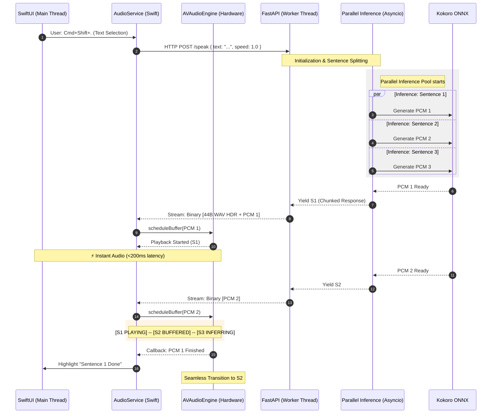

# 🏗️ System Architecture

SuperSay uses a hybrid architecture: a high-performance **Python/ONNX** inference engine wrapped in a native **SwiftUI** macOS shell.

### Parallel Execution Flow

## 🧠 The Zero-Latency Pipeline

The core innovation of SuperSay is the **Parallel Inference Stream**. Traditional TTS apps generate a whole file before playing. SuperSay treats audio as a real-time stream.

### 1. The Producer (Python Backend)

The backend (`backend/app/services/tts.py`) is an `Async Generator`:

1.  **Sentence Splitting:** It splits input text into semantic chunks using regex.
2.  **Parallel Tasks:** It fires off ONNX inference tasks for all sentences simultaneously using `asyncio.create_task`.
3.  **WAV Chunking:** As soon as the first sentence is ready, it yields a 44-byte WAV header followed by raw PCM data.
4.  **Semantic Gaps:** It injects precise durations of silence between chunks based on punctuation (e.g., 0.8s for periods, 0.4s for commas).

### 2. The Consumer (Swift Frontend)

The frontend (`AudioService.swift`) manages an `AVAudioEngine` player node:

1.  **Buffer Management:** It receives binary data via `URLSessionDataDelegate`.
2.  **Hardware Sync:** Chunks are converted to `AVAudioPCMBuffer` and scheduled.
3.  **Completion Callbacks:** It uses hardware-level callbacks to track when a buffer has *actually* finished vibrating the speakers, allowing for pixel-perfect UI progress updates.

## 📦 Deployment: The Self-Extracting Bundle

To avoid requiring users to install Python or ONNX:

1.  **PyInstaller:** Compiles the backend into a standalone binary `SuperSayServer`.
2.  **Zipping:** The binary and models (`kokoro-v1.0.onnx`) are zipped into `SuperSayServer.zip`.
3.  **LaunchManager:** On first launch, the Swift app extracts this zip to `~/Library/Application Support/SuperSayServer` and manages its lifecycle via `localhost:10101`.

## 🎓 Academic PDF Pipeline

The `PDFService` uses a multi-pass approach for research papers:

-   **Pass 1 (Statistical):** Identifies headers/footers by counting line frequency across pages (lines appearing on >30% of pages are scrubbed).
-   **Pass 2 (Regex):** Strips IEEE and APA citations.
-   **Pass 3 (Cleanup):** Reconstructs words split by line-break hyphens.
