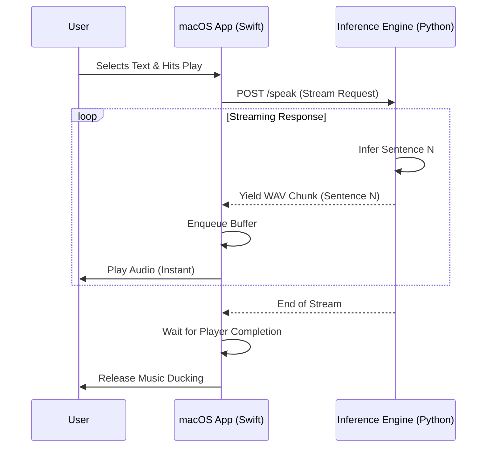

# 🏗️ System Architecture

SuperSay is a hybrid application combining the native fluidity of **SwiftUI** with the machine learning ecosystem of **Python**.

## 🧠 The Producer-Consumer Model (Zero Latency)

Traditional text-to-speech apps wait for the entire audio file to be generated before playing. This causes awkward pauses. SuperSay uses a **Producer-Consumer** architecture to achieve "instant" playback.

### 1. The Producer (Python Backend)
The backend (`App/services/tts.py`) is an **Async Generator**. It does NOT generate a single WAV file. Instead:
1.  It receives the full text.
2.  It splits the text into semantic chunks (sentences).
3.  As soon as **Sentence 1** is inferred (in milliseconds), it is yielded immediately as a binary chunk.
4.  It proceeds to Sentence 2 while sentence 1 is being transmitted.

### 2. The Consumer (Swift Frontend)
The frontend (`AudioService.swift`) implements a hardware-synced **Audio Queue**:
1.  **Buffering**: It receives the first chunk from the API stream.
2.  **Instant Play**: It immediately schedules this chunk on the `AVAudioEngine` player node.
3.  **Completion Handlers**: It attaches a hardware callback to the end of the buffer. *Only* when the hardware signals "I am finished playing buffer A" does the logic trigger the next state or finish the session.

This ensures seamless, gapless playback even if the network or inference slows down slightly.

## 📦 Zero-Dependency Deployment (The Zipped Backend)

To make the app portable (drag-and-drop install) without requiring the user to install Python, we use a novel **Self-Extracting Bundle** strategy.

### Build Time
1.  We use `PyInstaller` to compile the Python environment, `espeak-ng` binary, ONNX models, and dependencies into a single folder.
2.  This folder is **Zipped** (`SuperSayServer.zip`).
3.  The Zip is embedded directly into the Swift App Bundle's `Resources/` folder.

### Run Time (`LaunchManager`)
1.  **Launch**: On app startup, `LaunchManager` checks `~/Library/Application Support/SuperSayServer`.
2.  **Extraction**: If missing, it unzips the embedded backend engine to this user-writable directory.
3.  **Execution**: It executes the binary from *Application Support*, ensuring full read/write permissions for temp files and logs.
4.  **Connect**: The Swift app waits for the local `localhost:10101` server to respond to a heartbeat before showing the UI.

This ensures the app is 100% self-contained but can still effectively run a complex Python/ONNX environment on macOS.

## 🎓 Academic PDF Preprocessing

SuperSay includes a specialized pipeline for reading research papers (`PDFService.swift` + `TextProcessor.swift`).

1.  **Statistical Pass**: The engine scans the *entire* document first. It counts line occurrences. Lines appearing on >30% of pages (like "Journal of ML - Vol 3" or page numbers) are identified as artifacts and scrubbed.
2.  **Smart De-hyphenation**: It detects words split across lines (e.g., `ex-\nample`) and reconstructs them (`example`) to prevent stuttering.
3.  **Citation Scrubbing**: Regex filters remove bracketed `[12-14]` and parenthetical `(Smith et al., 2020)` citations to improve listening flow.
