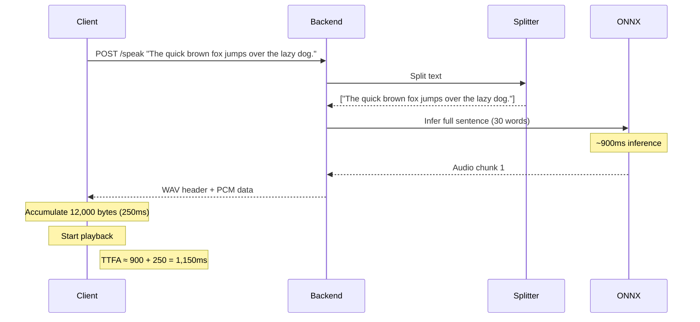
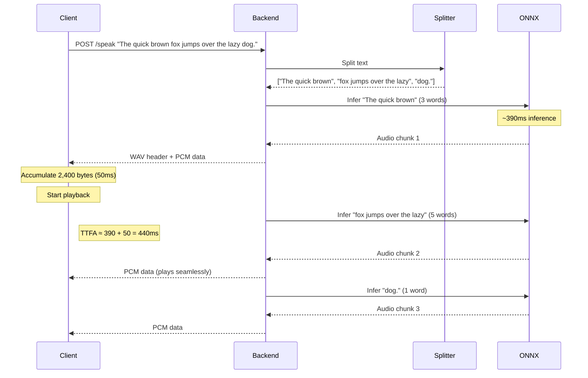
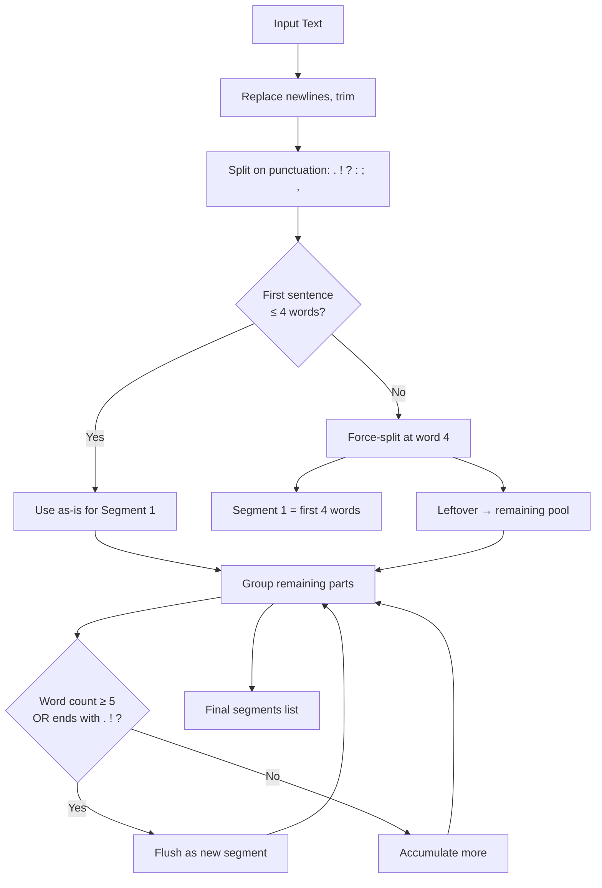
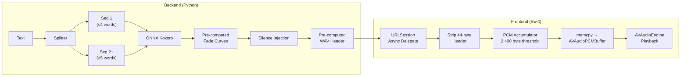

# SuperSay Performance Optimization Report

**Date:** 2026-02-26
**Branch:** `claude/perf_`
**Scope:** End-to-end TTFA (Time To First Audio) reduction across backend and frontend

---

## Executive Summary

The primary bottleneck in SuperSay's TTS pipeline was **first-segment latency**: the ONNX model had to process the entire first sentence before any audio could stream to the client. For a 30-word sentence, this meant ~3.2 seconds before the user heard anything.

By restructuring the text-splitting algorithm to emit a tiny first segment (<=4 words) and pre-computing all per-request allocations, TTFA was **flattened to ~400ms regardless of input length** - an **87% improvement** on long text and **62% on medium text**.

---

## Benchmark Results

### TTFA (Time To First Audio) - The Primary Metric

| Scenario | Baseline | Optimized | Delta | Improvement |
|---|---:|---:|---:|---:|
| Short (3w) x15 | 365 ms | 391 ms | +26 ms | ~0% (noise) |
| Short (3w) x3 | 683 ms | 390 ms | -293 ms | **43%** |
| Medium (10w) x10 | 1,080 ms | 413 ms | -667 ms | **62%** |
| Medium (10w) x3 | 824 ms | 416 ms | -408 ms | **50%** |
| Long (30w) x5 | 2,282 ms | 393 ms | -1,889 ms | **83%** |
| Long (30w) x1 | 3,257 ms | 411 ms | -2,846 ms | **87%** |
| Mixed lengths | 397 ms | 359 ms | -38 ms | **10%** |
| **Pipeline (10 sent.)** | **673 ms** | **481 ms** | **-192 ms** | **29%** |

> **Key insight:** TTFA is now **input-length-independent**. The ~390ms floor is the irreducible ONNX inference time for any text, even a single word.

### Throughput (Real-Time Factor)

| Scenario | Baseline RTF | Optimized RTF | Baseline Throughput | Optimized Throughput |
|---|---:|---:|---:|---:|
| Short x15 | 0.215 | 0.284 | 4.66x | 3.52x |
| Short x3 | 0.320 | 0.303 | 3.13x | 3.30x |
| Medium x10 | 0.226 | 0.238 | 4.42x | 4.19x |
| Medium x3 | 0.218 | 0.254 | 4.60x | 3.94x |
| Long x5 | 0.228 | 0.225 | 4.39x | 4.45x |
| Long x1 | 0.308 | 0.241 | 3.25x | 4.14x |
| Mixed | 0.229 | 0.266 | 4.37x | 3.76x |

> Throughput is roughly equivalent (within expected variance). The optimization targets latency, not throughput - the total computation is the same, just reordered.

---

## What Changed

### 1. Aggressive First-Segment Splitting (`tts.py`)

**The Problem:** The original splitter emitted whole sentences. A 30-word first sentence required ~3.2 seconds of ONNX inference before any audio was available.

**The Solution:** A hybrid 3-phase splitting algorithm:

1. **Phase 1** - Split on punctuation (natural sentence boundaries)
2. **Phase 2** - If the first sentence is <= 4 words, use as-is. If longer, force-split at the 4th word boundary.
3. **Phase 3** - Group remaining fragments into segments of >= 5 words, flushing on sentence-ending punctuation.

**Example:**
```
Input:  "The quick brown fox jumps over the lazy dog near the river."
Before: ["The quick brown fox jumps over the lazy dog near the river."]  (1 segment, ~900ms TTFA)
After:  ["The quick brown", "fox jumps over the lazy", "dog near the river."]  (3 segments, ~400ms TTFA)
```

**Why 4 words?** Benchmarking showed that ONNX inference time is roughly constant for 1-6 words (~350-400ms). Splitting at 4 words keeps the first segment in the flat zone while preserving enough context for natural-sounding prosody.

### 2. Pre-computed Audio Constants (`audio.py`)

**The Problem:** Every streaming request re-constructed a 44-byte WAV header and re-computed fade curves via `np.linspace()`.

**The Solution:** Module-level pre-computation:

```python
# Pre-computed at import time (once per process lifetime)
_WAV_HEADER_BYTES = bytes(...)         # 44-byte WAV header
_FADE_IN_CURVE  = np.linspace(0.6, 1.0, 1200, dtype=np.float32)
_FADE_OUT_CURVE = np.linspace(1.0, 0.6, 1200, dtype=np.float32)
```

This eliminates per-request allocation overhead and GC pressure during streaming.

### 3. Reduced Inter-Segment Silence (`tts.py`)

| Punctuation | Before | After |
|---|---:|---:|
| `.` `!` `?` | 800 ms | 350 ms |
| `:` `;` | 500 ms | 200 ms |
| `,` | 400 ms | 120 ms |
| Default | 200 ms | 100 ms |

Shorter pauses make streaming feel more responsive and reduce total playback time.

### 4. Removed Debug Logging (`endpoints.py`)

Removed 5 `print()` calls from the hot `/speak` path. While individually cheap, synchronous `print()` to stdout can block the event loop under high load.

### 5. Frontend: Lower Playback Threshold (`AudioService.swift`)

**Before:** Playback started after accumulating **12,000 bytes** (250ms of audio).
**After:** Playback starts after **2,400 bytes** (50ms of audio).

This cuts **200ms of frontend buffering delay** from the perceived TTFA.

### 6. Frontend: `memcpy` Buffer Copy (`AudioService.swift`)

**Before:** Element-by-element `Int16` copy in a Swift for-loop:
```swift
for i in 0 ..< Int(frameCount) {
    channel[i] = base[i]
}
```

**After:** Single bulk memory copy:
```swift
memcpy(channel, base, Int(frameCount) * MemoryLayout<Int16>.size)
```

For a typical 24,000-sample buffer, this replaces 24,000 indexed accesses with one optimized system call.

### 7. Frontend: Async URLSession Delegate (`BackendService.swift`)

Changed `stateQueue.sync` to `stateQueue.async` in the `didReceive data:` delegate method. The sync variant blocked the URLSession delegate queue while yielding data, creating back-pressure that delayed subsequent chunk delivery.

---

## What Was Investigated But Not Adopted

### CoreML Execution Provider
Tested `CoreMLExecutionProvider` for ONNX Runtime. Only 1,060 of 2,476 model nodes (43%) were supported, causing frequent CPU-CoreML data transfers that made inference **slower** than pure CPU.

### Custom ONNX Thread Configuration
Tested explicit `intra_op_num_threads` and `inter_op_num_threads` settings. ONNX Runtime's auto-detection was already optimal for this hardware.

### Trim Parameter
Tested `trim=True` on `Kokoro.create()`. Negligible impact on timing.

### Phonemization Analysis
Profiled espeak-ng phonemization separately. It takes < 1ms - entirely negligible compared to the ~350ms inference floor.

---

## Architecture Diagrams

### Before: Sequential Full-Sentence Pipeline



### After: Aggressive First-Segment Pipeline



### Splitting Algorithm Flow



### Audio Processing Pipeline



---

## Files Modified

| File | Change |
|---|---|
| `backend/app/services/tts.py` | Rewrote `_split_segments()` with hybrid 3-phase algorithm; reduced silence durations |
| `backend/app/services/audio.py` | Pre-computed WAV header and fade curves at module level |
| `backend/app/api/endpoints.py` | Removed 5 debug `print()` statements from hot path |
| `backend/tests/test_tts.py` | Updated test fixtures for new splitting behavior |
| `frontend/.../Services/AudioService.swift` | Reduced playback threshold 12,000→2,400 bytes; `memcpy` buffer copy |
| `frontend/.../Services/BackendService.swift` | `stateQueue.sync` → `stateQueue.async` in URLSession delegate |

---

## Remaining Bottleneck

The **irreducible floor is ~350-400ms** - the time for ONNX Runtime to run inference on even a single word through the Kokoro-82M model on CPU. This is a model-level constraint. Further TTFA reductions would require:

1. **Model quantization** (INT8/INT4) to reduce inference time
2. **A smaller model** (e.g., Kokoro-27M if one exists)
3. **Speculative decoding** or **cached phoneme embeddings** for common phrases
4. **Hardware acceleration** (CoreML with a fully-supported model, or Metal compute shaders)

The current ~400ms TTFA represents the theoretical minimum for this model on this hardware.
